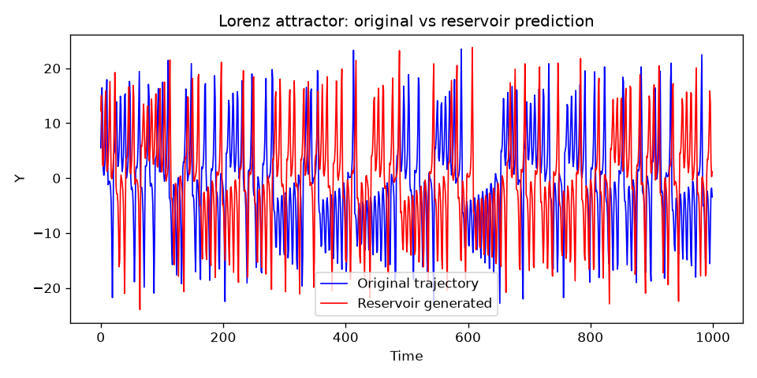

# Chaos Reservoir Computing

A minimal echo-state reservoir implementation for learning and predicting chaotic dynamical systems (Lorenz attractor).

## Installation

```bash
pip install numpy matplotlib jitcode networkx
```

- [jitcode](https://github.com/neurophysik/jitcode) — ODE integration for generating training trajectories
- [NetworkX](https://networkx.org/) — reservoir graph topology

## Quickstart (Lorenz attractor)

```bash
python lorenz.py
```

This integrates the Lorenz system, trains a reservoir on the trajectory, and plots the original vs. reservoir-generated time series.

### Common arguments

| Argument | Default | Description |
|----------|---------|-------------|
| `--res_size` | 500 | Reservoir neuron count |
| `--leaky_rate` | 0.7 | Leaky integration rate |
| `--spectral_radius` | 0.7 | Reservoir weight matrix spectral radius |
| `--inputScaling_radius` | 0.4 | Input weight scale (sensitive; avoid changing casually) |
| `--train_data_ratio` | 0.7 | Fraction of trajectory used for training |
| `--trans_ratio` | 0.35 | Transient fraction before training |
| `--random_seed` | None | Seed for reproducible weight initialization |
| `--save_dir` | `./lorenz` | Output directory for `.dat` files and figures |

Run `python lorenz.py --help` for the full list.

## Rossler attractor

A separate script is provided for the Rossler system:

```bash
python rossler.py
```

**Note:** Rossler results are sensitive to random reservoir initialization. Due to weight randomness at compile time, runs can either converge well or diverge. Lorenz is the more reliable demonstration.

## Example output

Reservoir prediction of the Lorenz Y coordinate (original vs. generated):



## Repository layout

- `Reservoir.py` — echo-state reservoir core
- `lorenz.py` — Lorenz attractor training and plotting
- `rossler.py` — Rossler attractor (experimental)
